# Pragma To-Do

Aplicación de tareas hecha con Ionic + Angular 21 y empaquetada con Cordova para Android e iOS. Permite crear, editar, completar y eliminar tareas; organizarlas por categoría; agendarlas en un día con hora de inicio y fin; y verlas en una agenda semanal o en un panel de avisos con lo vencido y lo próximo.

Todo el estado vive en NgRx y los datos se guardan en el dispositivo, así que la app funciona sin conexión y las tareas sobreviven al cierre de la aplicación.

---

## Requisitos previos

- Node.js 20 o superior y npm
- Cordova CLI: `npm install -g cordova`
- **Android**: Android Studio con un SDK instalado y la variable `ANDROID_HOME` apuntando a la carpeta del SDK, que es de donde Cordova saca las herramientas de compilación (en macOS suele ser `~/Library/Android/sdk`)
- **iOS**: macOS con Xcode. No hace falta CocoaPods: ninguno de los plugins de este proyecto declara *pods*, y Cordova solo lo necesita si se agrega uno que sí

## Instalación

```bash
git clone https://github.com/sneydermc3007/pragma-todo-app.git
cd pragma-todo-app
npm install
```

Las plataformas nativas se agregan una sola vez:

```bash
cordova platform add android
cordova platform add ios
```

## Correr la app

### En el navegador

```bash
ionic serve
```

Levanta la app con recarga en caliente. El equivalente sin el CLI de Ionic es `npm start`, que corre `ng serve`. En el navegador la persistencia cae en IndexedDB en lugar de SQLite; el resto funciona igual.

### En emulador o simulador

```bash
npm run emulate:android
npm run emulate:ios
```

Cada uno compila el bundle web y después la app nativa. Si el emulador ya está abierto, Cordova lo reutiliza.

### En dispositivo físico

Conectá el teléfono por USB con la depuración habilitada (Android) o confiá el certificado de desarrollo (iOS) y corré:

```bash
npm run run:android
npm run run:ios
```

**Si Android responde `Could not find target matching { type: 'device' }`**, el build está bien: `run:android` usa `cordova run android --device`, y ese `--device` apunta a un teléfono físico, no al emulador. Verificá con `adb devices` que aparezca listado como `device` —si dice `unauthorized`, falta aceptar el diálogo de depuración en la pantalla del teléfono—. Para el emulador el comando es `npm run emulate:android`. Y si el APK ya está compilado, alcanza con:

```bash
adb install -r platforms/android/app/build/outputs/apk/debug/app-debug.apk
```

En iOS la app tiene que ir firmada, aunque sea para tu propio teléfono. Antes del primer `run`:

1. Xcode → *Settings* → *Accounts* → agregá tu Apple ID (una cuenta gratuita alcanza para desarrollo).
2. Abrí `platforms/ios/App.xcworkspace`, entrá al target **App** → *Signing & Capabilities*, marcá *Automatically manage signing* y elegí tu *Team*.
3. La primera vez, en el teléfono: *Ajustes → General → VPN y gestión de dispositivos* → confiar en el certificado.

Sin ese paso el build llega hasta el final y se corta con `Signing for "App" requires a development team`. En el simulador no hace falta nada de esto.

**Si `npm run run:ios` termina con `ios-deploy was not found`**, el problema no es el proyecto: compiló, firmó y exportó bien —el log dice `ARCHIVE SUCCEEDED` y `EXPORT SUCCEEDED`— y lo único que falta es la herramienta con la que Cordova copia la app al teléfono. Se resuelve de dos maneras:

```bash
npm install -g ios-deploy
```

o, sin instalar nada, usando lo que ya trae Xcode sobre el `.ipa` que el paso anterior dejó en `platforms/ios/build/Debug-iphoneos/`:

```bash
xcrun devicectl list devices
xcrun devicectl device install app --device <id> "platforms/ios/build/Debug-iphoneos/Pragma To-Do.ipa"
xcrun devicectl device process launch --device <id> com.sneydermc.todoapp
```

El teléfono tiene que estar desbloqueado para el `launch`: con la pantalla bloqueada, iOS lo rechaza con `its profile has not been explicitly trusted by the user`, que confunde porque suena a un problema de firma y no lo es.

### Otros comandos

| Comando | Qué hace |
|---|---|
| `npm run build:android` / `npm run build:ios` | Compila el APK / el proyecto iOS en modo desarrollo |
| `npm run build:android:release` / `npm run build:ios:release` | Lo mismo, con el bundle de producción |
| `npm test` | Corre las pruebas unitarias (Vitest) en modo watch |
| `npx ng test --watch=false` | Una sola corrida, para CI |
| `npm run lint` | ESLint sobre `.ts` y `.html` |

---

## Arquitectura

### Dirección de las dependencias

```
features → store → services → models
```

Cada capa conoce solo a la de abajo. Un componente no sabe de dónde salen los datos: despacha una acción y lee un *selector*. El store no sabe de SQLite: le pide al service. El service no sabe de tareas ni de categorías más allá de su modelo.

```
src/app/
├── core/                     utilidades sin dueño: fechas, ids, iconos, i18n, Firebase, validadores compartidos
└── features/
    ├── tasks/                modelos, store, services, páginas y componentes de tareas
    ├── categories/           lo mismo, para categorías
    └── remote-config/        feature flags: modelo, store y service
```

Dentro de cada feature la estructura se repite: `models/`, `store/`, `services/`, `pages/`, `components/`, `validators/`. Buscar algo es siempre el mismo camino.

### Estado con NgRx

- **Store, effects y selectores memoizados.** Los componentes leen con `store.selectSignal(...)`, así que el estado entra como *signal* y la app corre **zoneless**, sin `zone.js`.
- **`@ngrx/entity`** para tareas y categorías: la colección se guarda normalizada (`ids` + `entities`), lo que evita recorrer arreglos para encontrar una tarea y da un `sortComparer` por colección — tareas por fecha de creación descendente, categorías por nombre.
- **El reducer es puro de verdad.** No genera ids ni fechas ni toca el almacenamiento: eso vive en los effects. Por eso todas las pruebas del reducer usan acciones `Success` y comparan valores exactos, sin `expect.any(String)`.
- **Se persiste antes de actualizar el estado.** El effect escribe en el almacenamiento y recién entonces despacha el `Success`. Si la escritura falla, el estado no cambia y la pantalla nunca muestra algo que no se guardó.
- **El slice de cada feature se registra con su ruta.** El de tareas se provee en `tasks.routes.ts` con `provideState`, así que solo existe cuando esa parte de la app se carga. Los de categorías y feature flags viven en la raíz, porque se necesitan desde el arranque.

### Persistencia

Ionic Storage con este orden de drivers: **SQLite → IndexedDB → localStorage**.

No se usa `localStorage` como almacenamiento principal a propósito: el WebView lo puede purgar cuando el sistema necesita espacio, y una app de tareas que pierde las tareas no sirve. SQLite es almacenamiento real del sistema de archivos; los otros dos quedan como red de contención para el navegador.

El service expone `Observable` en lugar de `Promise`. Eso lo hace encajar directo en los effects sin envolver nada, y deja el driver escondido detrás de una interfaz: cambiar el almacenamiento no obliga a tocar ni un effect ni un componente.

También trae una migración silenciosa: una tarea guardada por una versión vieja, sin categoría ni fecha agendada, se completa al leerla en lugar de romper la pantalla.

**Está verificado en dispositivo físico**, que es lo único que prueba que SQLite se está usando de verdad y no el respaldo del navegador. Corriendo en un iPhone, el log del plugin muestra la base abierta en el contenedor de la app:

```
-[SQLitePlugin openNow:] open full db path:
/var/mobile/Containers/Data/Application/.../Library/LocalDatabase/todoDb
OPEN database: todoDb — OK
```

### Internacionalización

El idioma se detecta del dispositivo al arrancar (`navigator.language`), con español como respaldo. No hay selector manual: si el teléfono está en inglés, la app está en inglés. Las fechas y los nombres de los días siguen el mismo idioma detectado.

---

## Feature flags

Los flags viven en **Firebase Remote Config** y se leen al arrancar. Hay dos:

| Flag | Qué controla | Cómo se ve |
|---|---|---|
| `dark_mode_enabled` | Tema oscuro de toda la app | Al encenderlo y reabrir, la app pasa de claro a oscuro |
| `use_24h_clock` | Formato de hora: 24 h o 12 h con AM/PM | Cambia la hora de las tarjetas, de la agenda y del selector del formulario |

`use_24h_clock` no está en `true` para todo el mundo: tiene una **condición por región**, de modo que los países donde se usa el horario de 24 horas lo reciben encendido y el resto lo recibe apagado. Es el caso que muestra para qué sirve de verdad la herramienta: el mismo binario se comporta distinto según quién lo abra, sin publicar una versión nueva.

**Cómo cambiarlos:** Firebase Console → *Remote Config* → editar el parámetro → **Publicar cambios**.

Cuándo llegan al teléfono depende de dos cosas. La app pide los flags **una sola vez, al arrancar**, y el SDK de Firebase aplica un caché: si la última descarga exitosa ocurrió hace menos que `minimumFetchIntervalMillis`, ni sale a la red. O sea que un flag recién publicado se ve **en el primer arranque que ocurra pasado ese intervalo**, no a los N minutos exactos de publicarlo.

En este proyecto el intervalo es **0 ms en las dos configuraciones**, de modo que cada arranque consulta: se publica el flag, se reabre la app y el cambio ya está. Es una decisión tomada para que los feature flags sean demostrables

Los dos valores por defecto son `false`, y si la consulta a Firebase falla la app arranca igual con esos valores. Una falla de red nunca enciende una función: en el peor caso el usuario ve la app en su forma más conservadora.

> **Sobre el tema claro/oscuro.** Que el tema dependa de un feature flag es una decisión **de la prueba, no de producto**. Se hizo así para poder demostrar Remote Config con algo que se ve de inmediato en pantalla. Lo correcto en una app real es que el tema siga la configuración del dispositivo —exactamente como está resuelto acá el idioma, que se detecta y se aplica solo—, o que el usuario lo elija a mano. El flag queda como demostración de la herramienta, no como la forma en que debería enviarse esta funcionalidad.

---

## Rendimiento y manejo de memoria

### Qué se midió y cómo

La lista de tareas es la pantalla que puede crecer sin límite, así que es la que se midió. Se sembraron **1000 tareas** directamente en la base SQLite del dispositivo y se comparó la misma pantalla, en el mismo emulador, antes y después de aplicar *virtual scroll*.

Las mediciones se tomaron con **Chrome DevTools** conectado al WebView (`chrome://inspect`), contando desde la consola los nodos reales del documento y leyendo el *heap* de JavaScript:

```js
document.querySelectorAll('app-task-card').length   // tarjetas montadas
document.querySelectorAll('*').length               // nodos totales
performance.memory.usedJSHeapSize                   // memoria de JS
```

### Resultado

| Métrica | Sin virtual scroll | Con virtual scroll |
|---|---:|---:|
| Tareas en el store | 1000 | 1000 |
| Tarjetas en el DOM | 1033 | 47 |
| Nodos totales del documento | 15 027 | 735 |
| Memoria de JS | 48,1 MB | 14,5 MB |

Un 95 % menos de nodos y menos de un tercio de la memoria, con los mismos datos en pantalla. Las 47 tarjetas incluyen las 33 del carrusel de «Tareas de hoy»; la lista larga aporta unas 14.

### Cómo se gestiona la memoria

- **Virtual scroll con reciclado.** Solo se renderizan las filas visibles más un margen; al hacer scroll se reutilizan las mismas vistas en lugar de crear y destruir. `trackBy` por id es lo que permite reciclar en vez de recrear.
- **Altura de fila determinada.** La estrategia de tamaño fijo necesita que todas las filas midan lo mismo, así que las tarjetas de la lista tienen alto fijo y el título y la descripción se recortan a una línea. Sin eso el cálculo de posición se desfasa y aparecen huecos.
- **Esqueleto pintado, no renderizado.** Al hacer un scroll muy rápido puede quedar un hueco sin dibujar. En vez de renderizar tarjetas de esqueleto —que costarían lo mismo que las reales—, el hueco muestra una silueta gris que es un degradado repetido de fondo: lo pinta el compositor, sin DOM ni JavaScript.
- **`OnPush` y zoneless.** Ningún componente se revisa por barrido global: la app no usa `zone.js` y el estado entra como *signals*, así que se recalcula solo lo que cambió.
- **Lazy loading por ruta**, con el slice de estado de tareas provisto en su propia ruta: el código y el estado de esa parte no existen hasta que se navega a ella.
- **Selectores memoizados y colección normalizada**, para no recorrer ni copiar arreglos en cada render.
- **Una sola inicialización del almacenamiento.** El service comparte la conexión con `shareReplay`, así que no se abre la base en cada operación.

---

## Versionado y CHANGELOG

- **[CHANGELOG.md](CHANGELOG.md)**, en formato [Keep a Changelog](https://keepachangelog.com/es-ES/1.1.0/) y escrito en español, orientado a qué cambió para quien usa la app.
- **[Versionado semántico](https://semver.org/lang/es/)**: una versión menor por cada feature entregable (`0.2.0` agenda, `0.3.0` categorías, `0.4.0` modo oscuro, `0.5.0` idiomas, `0.6.0` formato de hora, `0.7.0` virtual scroll, `0.8.0` paleta de diseño), y versiones de parche solo cuando el release contiene **únicamente** correcciones.
- **[Conventional Commits](https://www.conventionalcommits.org/es/)** en los mensajes, en inglés, con el cuerpo explicando el *porqué* cuando la decisión no es evidente.
- **Tags anotados** por cada versión. Cada tag apunta a un estado que compila y corre, así que se puede revisar la app en cualquier punto de su historia.

El changelog se escribe **a mano y no se autogenera**. Un changelog generado a partir de los commits describe el código; este describe el producto. «La última tarea de la lista ya no queda tapada por el botón de agregar» es información útil para quien usa la app, y no hay commit del que se pueda derivar sola esa frase.

---

## Capturas

El material de soporte completo está en **[`docs/capturas/`](docs/capturas/)**, numerado en el orden en que se construyó la app.

### 1. Primera versión

| | |
|---|---|
| 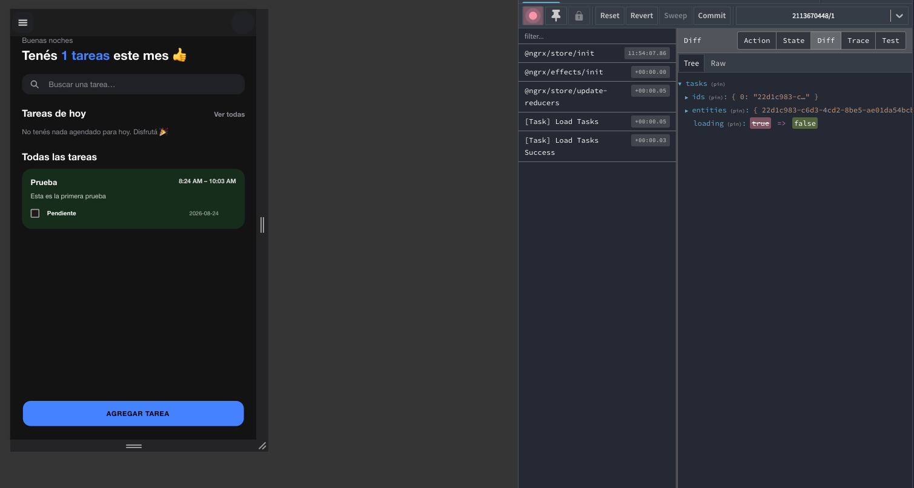 | 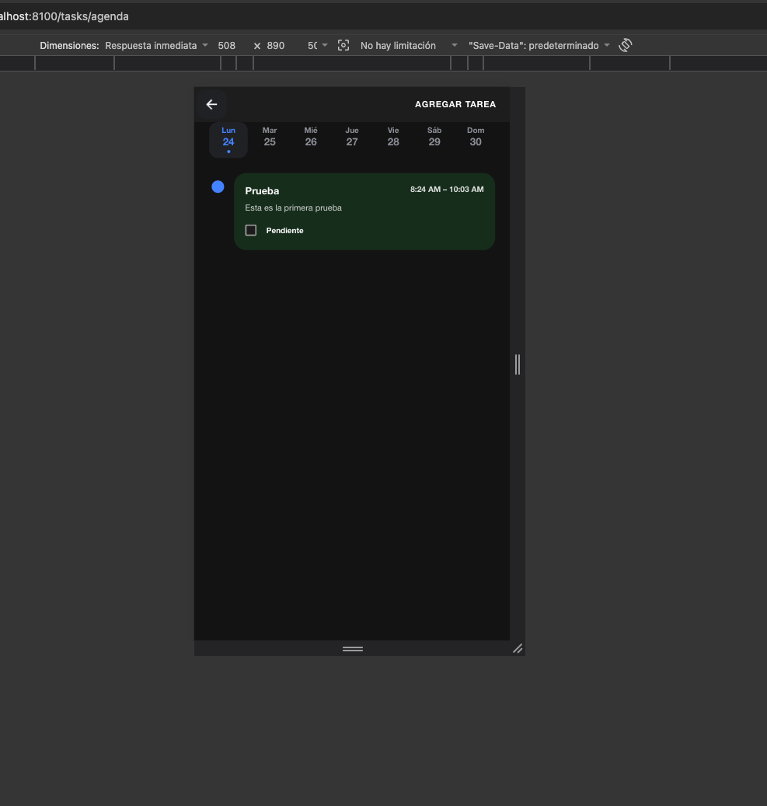 |
| **1.0** — App en su primera versión, ya integrada con NgRx. | **1.1** — Vista de agenda. |

### 2. Categorías, formulario y filtros

🎬 **2.0 (video)** — [Flujo del manejo de estado entre la tarea y la categoría](docs/capturas/2.0-flujo-estado-tarea-categoria.mov)

| | |
|---|---|
| 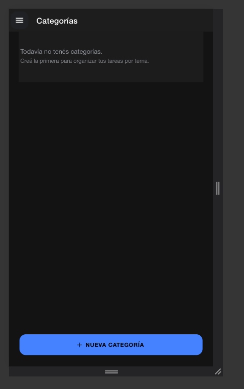 | 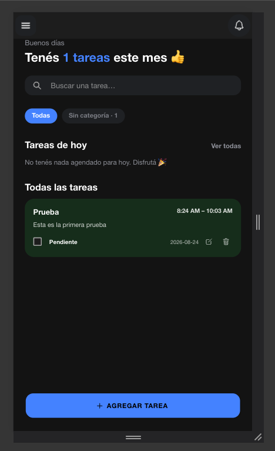 |
| **2.0 (foto)** — Vista de agregar categorías. | **2.1** — Lista con una tarea creada y el estado vacío de «Tareas de hoy». |
| 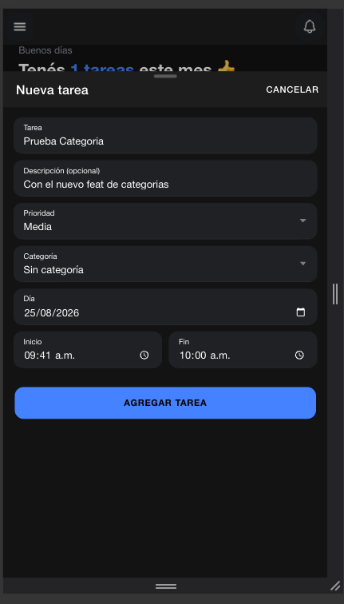 | 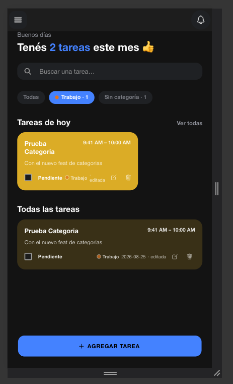 |
| **2.2** — *Bottom sheet* para agregar tareas. | **2.6** — Filtro activo de categoría. |
| 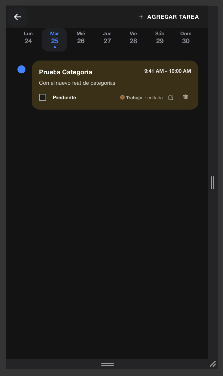 | 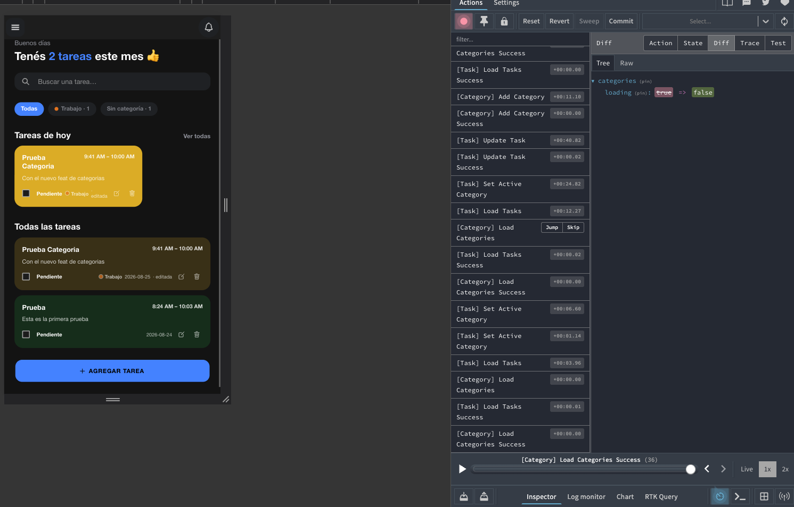 |
| **2.7** — Vista de agenda con una tarea. | **2.8** — Tareas del día de hoy y chip para filtrar por categoría, con el manejo de estado. |

### 3. Primer feature flag: modo oscuro

| | |
|---|---|
| 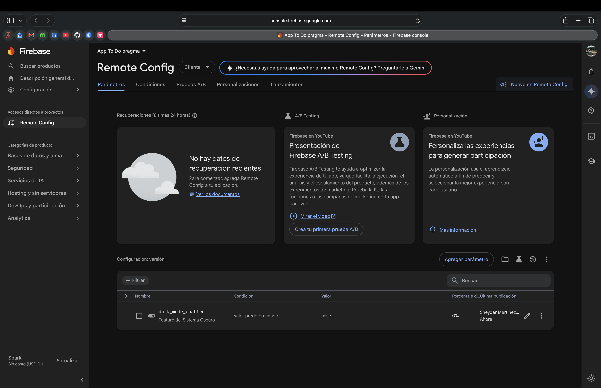 | 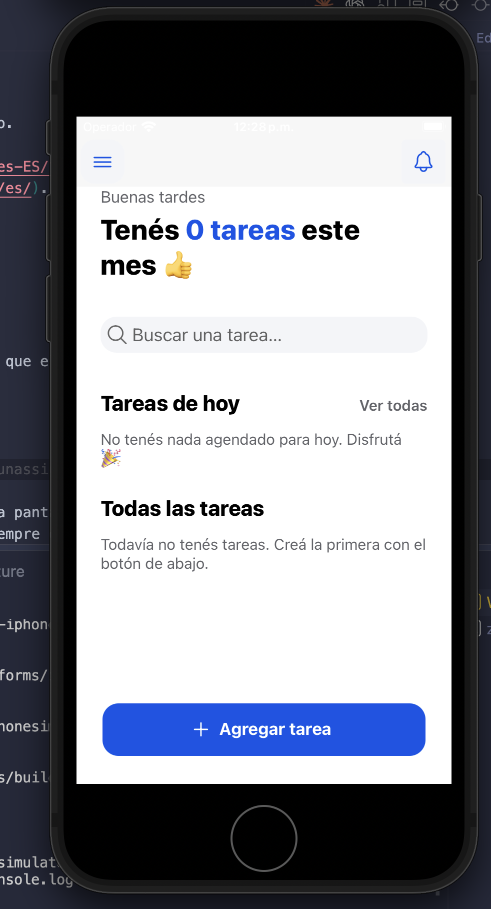 |
| **3.0** — Configuración del primer feature flag desde Firebase, con el modo oscuro deshabilitado. | **3.1** — Simulador de iOS con tema claro. |
| 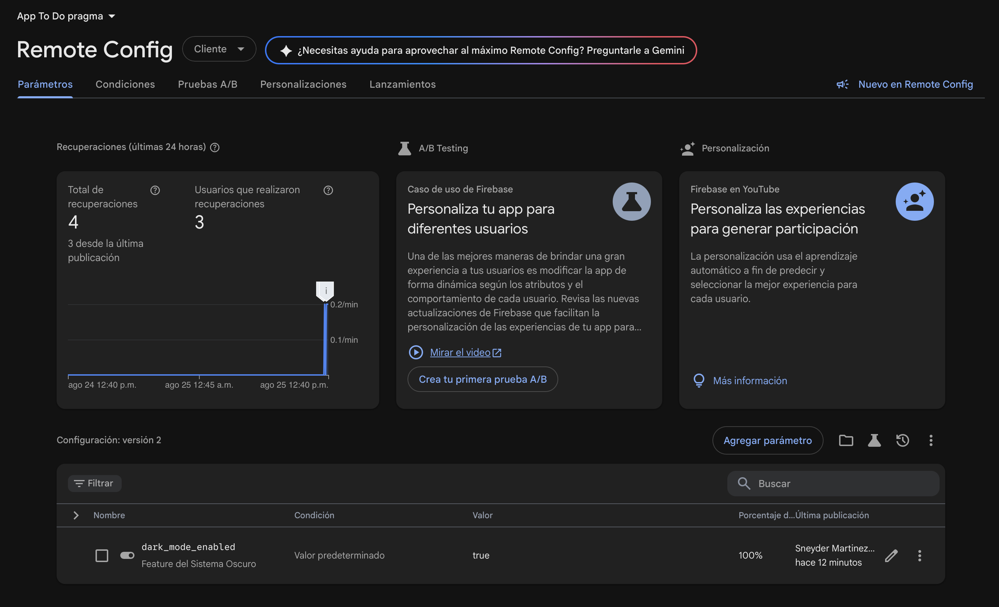 | 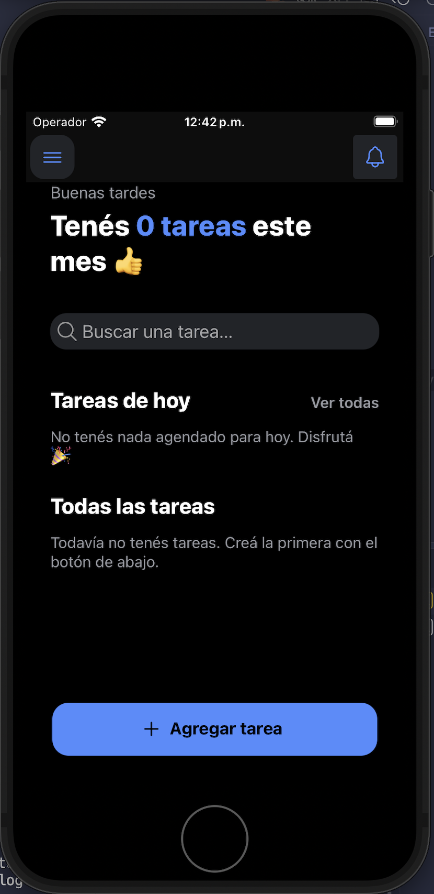 |
| **3.2** — El mismo flag habilitado desde Firebase. | **3.3** — Simulador de iOS con tema oscuro, sin publicar una versión nueva. |

### 4. Idioma según el dispositivo

| | |
|---|---|
| 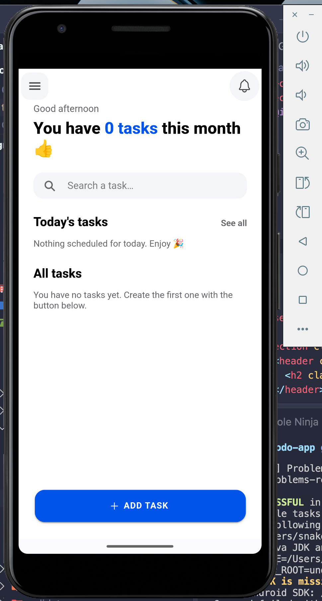 | 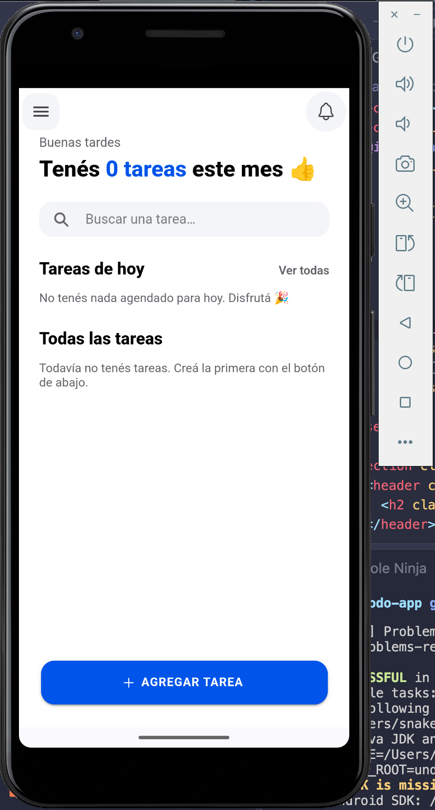 |
| **4.0** — App en inglés a partir de la configuración del sistema. | **4.2** — App en español a partir de la configuración del sistema. |

### 5. Feature flag dinámico por región

| | |
|---|---|
| 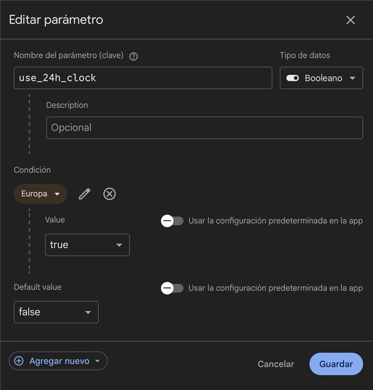 | 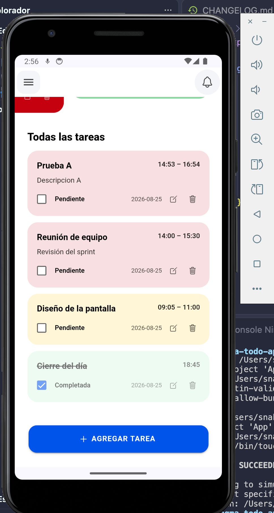 |
| **5.0** — Se agrega un feature flag dinámico —formato de horario de 24 horas— según la región. | **5.2** — La app mostrando el horario de 24 horas por entrar en la región configurada. |

### 6. Rendimiento

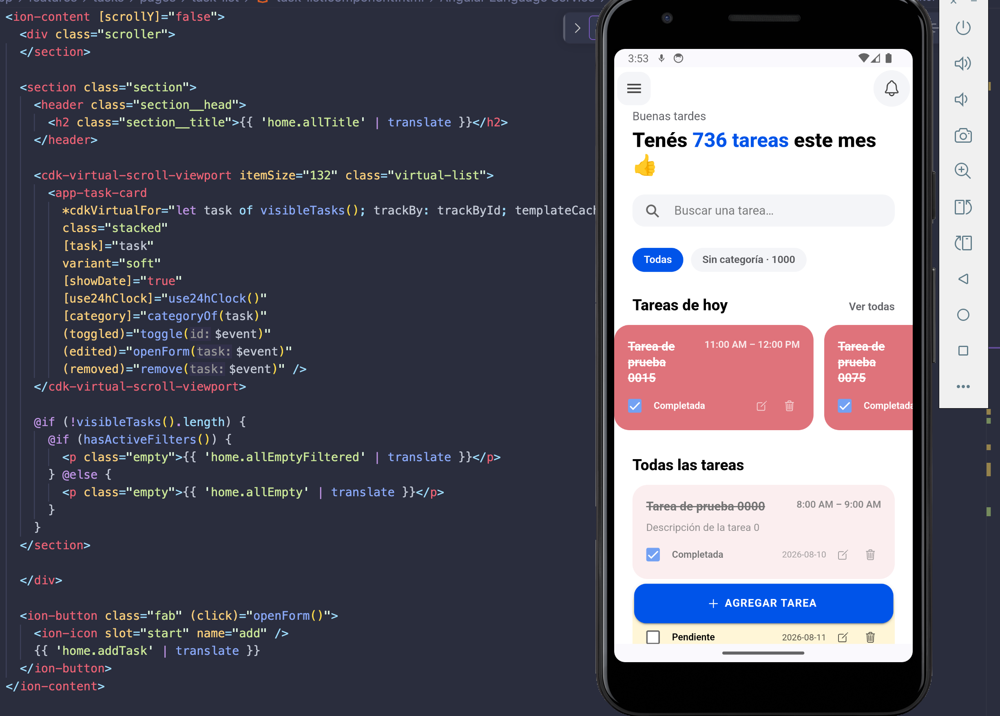

**6.0** — Implementación de *virtual scroll* para el manejo de la visualización y el rendimiento con grandes cantidades de tareas.

### 7. Rebranding

| | |
|---|---|
| 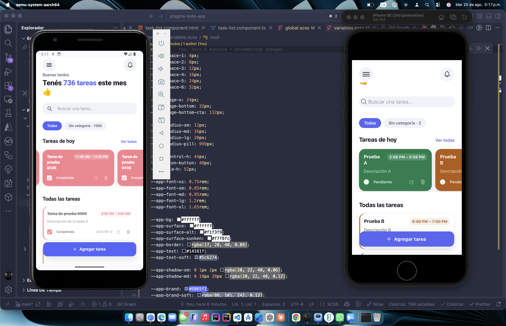 | 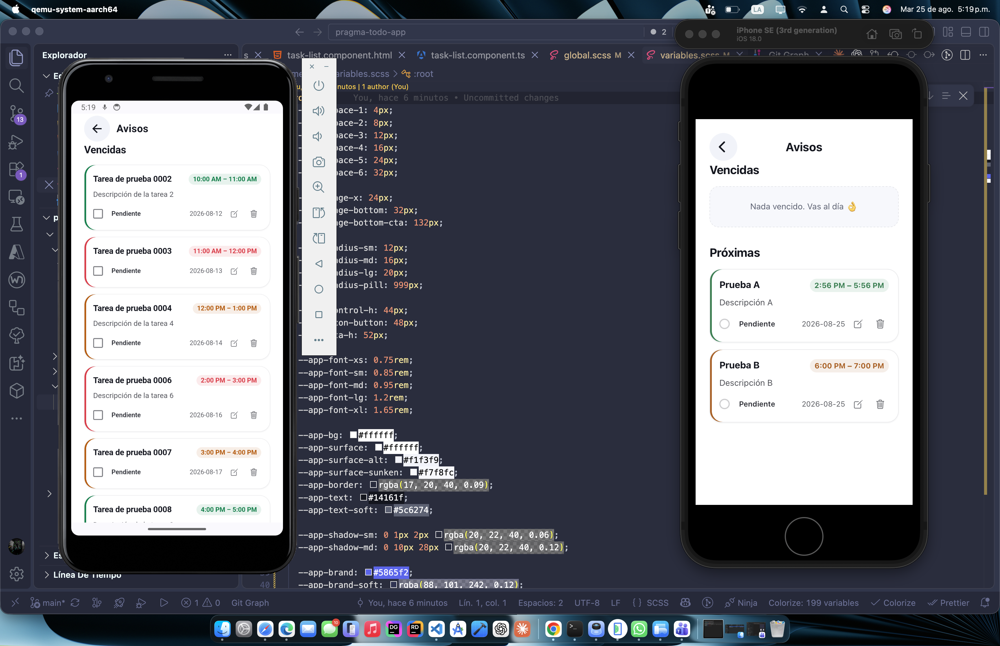 |
| **7.0** — Rebranding de la app en Android e iOS, junto al archivo de tokens que define la paleta. | **7.2** — La pantalla de avisos con la paleta nueva en ambas plataformas. |
